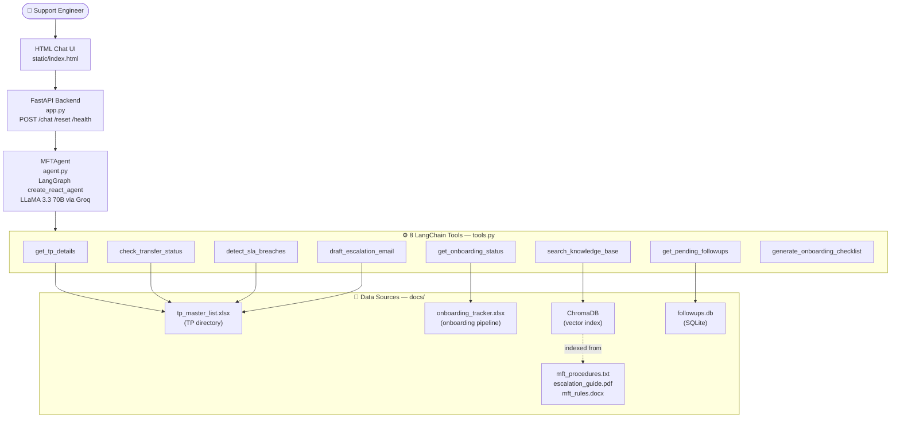

An AI-powered operations assistant for MFT/EDI support engineers. Built with LangGraph, FastAPI, and LLaMA 3.3 via Groq.

## Demo

> Ask the agent about trading partner details, transfer failures, SLA breaches, onboarding status, escalations — it looks up real docs and gives actionable responses.


🔗 **Live:** https://huggingface.co/spaces/aditya1401/mft-operations-agent

---

## Architecture



---

## Features

- **TP Lookup** — Trading partner details, Job Owner, protocol, connection type, and password reset policy
- **Transfer Status** — Latest file transfer status with error diagnosis and recommended actions
- **SLA Breach Detection** — Flags breached and at-risk TPs by protocol threshold (SFTP=4h, AS2=2h, FTPS=6h)
- **Onboarding Tracker** — Live stage tracking from `onboarding_tracker.xlsx` with OVERDUE alerts
- **Pending Follow-ups** — Overdue and escalated items from SQLite tracker
- **Knowledge Base Search** — Semantic vector search over MFT SOPs using ChromaDB + RAG
- **Escalation Drafting** — Professional escalation emails with TP context and password reset warnings
- **Onboarding Checklist** — Protocol-specific setup steps for new trading partners

---

## Tech Stack

| Layer | Technology |
|-------|-----------|
| LLM | LLaMA 3.3 70B via Groq |
| Agent Framework | LangGraph `create_react_agent` |
| Vector Search | ChromaDB + sentence-transformers |
| Backend | FastAPI + Uvicorn |
| Frontend | HTML / CSS / Vanilla JS |
| Doc Parsing | openpyxl, pdfplumber, python-docx |
| Database | SQLite (follow-up tracker) |
| Deployment | Docker on Hugging Face Spaces |

---

## Tools

| Tool | Description |
|------|-------------|
| `get_tp_details` | TP lookup by ID or name — returns protocol, connection type, JO, password reset policy |
| `check_transfer_status` | Latest transfer status with error codes and recommended actions |
| `detect_sla_breaches` | SLA monitoring — flags breached and at-risk TPs by protocol threshold |
| `get_onboarding_status` | Onboarding stage tracker — reads live from onboarding_tracker.xlsx |
| `get_pending_followups` | Overdue/escalated items from SQLite follow-up tracker |
| `search_knowledge_base` | Semantic search via ChromaDB — finds relevant SOPs and procedures |
| `draft_escalation_email` | Auto-drafted escalation email with TP context and password reset warning |
| `generate_onboarding_checklist` | Protocol-specific onboarding checklist for new TPs |

---

## Setup

### Prerequisites
- Python 3.10+
- Groq API key (free at [console.groq.com](https://console.groq.com))

### Installation

```bash
git clone https://github.com/adii1401/mft-operations-agent.git
cd mft-operations-agent
pip install -r requirements.txt
```

### Configuration

Create a `.env` file:
```env
GROQ_API_KEY=your_groq_api_key_here
```

### Run

```bash
python app.py
```

Open [http://localhost:7860](http://localhost:7860)

---

## Project Structure

```
mft-operations-agent/
├── app.py                      ← FastAPI backend
├── agent.py                    ← LangGraph agent with LLaMA 3.3
├── tools.py                    ← 8 LangChain tools
├── requirements.txt
├── Dockerfile
├── .dockerignore
├── .env                        ← API keys (not committed)
├── chroma_db/                  ← Vector index (auto-generated)
├── static/
│   └── index.html              ← Dark theme chat UI
└── docs/
    ├── tp_master_list.xlsx
    ├── onboarding_tracker.xlsx
    ├── mft_procedures.txt
    ├── escalation_guide.pdf
    └── mft_rules.docx
```

---

## Notes

- ChromaDB embedding model is pre-downloaded at Docker build time — no cold start failures
- Groq free tier: 100k tokens/day. Vector search reduces token usage ~80% vs full-doc loading
- SLA thresholds are protocol-based: SFTP=4h, AS2=2h, FTPS=6h
- Onboarding tracker reads live from `onboarding_tracker.xlsx` — update the file to reflect real pipeline
- Agent recursion limited to 10 steps to prevent infinite tool loops

---

## Related Projects

- [MFT Email Responder](https://github.com/adii1401/mft-email-responder) — Project 1: AI-powered email triage and response with RAG + Microsoft Graph API

---

Built as part of an AI Automation Engineer portfolio.