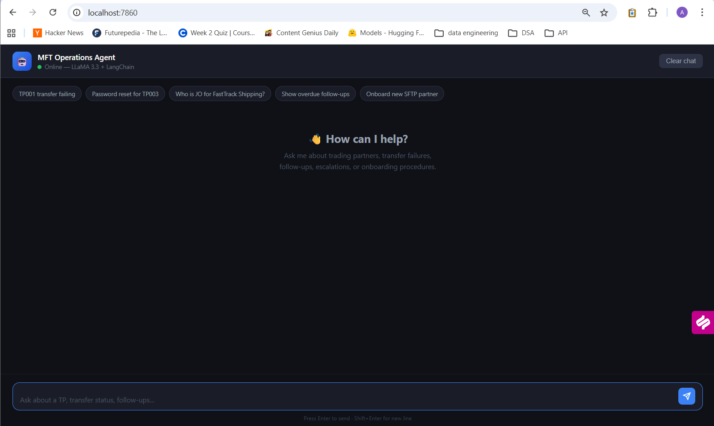

# MFT Operations Agent 🤖

An AI-powered operations assistant for MFT/EDI support engineers. Built with LangGraph, FastAPI, and LLaMA 3.3 via Groq.

## Demo

> Ask the agent about trading partner details, transfer failures, escalations, and onboarding — it looks up real docs and gives actionable responses.



## Features

- **TP Lookup** — Find trading partner details, Job Owner, protocol, and status by TP ID or company name
- **Transfer Status** — Check latest file transfer status with error diagnosis
- **Pending Follow-ups** — View overdue and escalated items from the tracker database
- **Knowledge Base Search** — Semantic vector search over MFT SOPs and procedures using ChromaDB
- **Escalation Drafting** — Auto-generate professional escalation emails with TP context
- **Onboarding Checklist** — Protocol-specific onboarding steps for new trading partners

## Architecture

```
HTML Chat UI (static/index.html)
        ↓ POST /chat
FastAPI (app.py)
        ↓
MFTAgent class (agent.py)
        ↓ LangGraph create_react_agent — LLaMA 3.3 70B via Groq
6 Tools (tools.py)
        ↓
┌─────────────────────────────────────────┐
│  tp_master_list.xlsx  (TP directory)    │
│  mft_procedures.txt   (SOPs)            │
│  escalation_guide.pdf (escalation paths)│
│  mft_rules.docx       (approval matrix) │
│  ChromaDB             (vector index)    │
│  followups.db         (SQLite tracker)  │
└─────────────────────────────────────────┘
```

## Tech Stack

| Layer | Technology |
|-------|-----------|
| LLM | LLaMA 3.3 70B via Groq |
| Agent Framework | LangGraph `create_react_agent` |
| Vector Search | ChromaDB + sentence-transformers |
| Backend | FastAPI + Uvicorn |
| Frontend | HTML / CSS / Vanilla JS |
| Doc Parsing | openpyxl, pdfplumber, python-docx |
| Database | SQLite (follow-up tracker) |

## Tools

| Tool | Description |
|------|-------------|
| `get_tp_details` | TP lookup by ID or name from Excel |
| `check_transfer_status` | Latest transfer status with error codes |
| `get_pending_followups` | Overdue/escalated items from SQLite |
| `search_knowledge_base` | Semantic search via ChromaDB |
| `draft_escalation_email` | Auto-drafted escalation with TP context |
| `generate_onboarding_checklist` | Protocol-specific onboarding steps |

## Setup

### Prerequisites
- Python 3.10+
- Groq API key (free at [console.groq.com](https://console.groq.com))

### Installation

```bash
git clone https://github.com/adii1401/mft-operations-agent.git
cd mft-operations-agent
pip install -r requirements.txt
```

### Configuration

Create a `.env` file:
```env
GROQ_API_KEY=your_groq_api_key_here
LLM_PROVIDER=groq
```

### Run

```bash
python app.py
```

Open [http://localhost:7860](http://localhost:7860)

## Project Structure

```
mft-operations-agent/
├── app.py              ← FastAPI backend
├── agent.py            ← LangGraph agent with LLaMA 3.3
├── tools.py            ← 6 LangChain tools
├── requirements.txt
├── .env                ← API keys (not committed)
├── .gitignore
├── chroma_db/          ← Vector index (auto-generated)
├── static/
│   └── index.html      ← Dark theme chat UI
└── docs/
    ├── tp_master_list.xlsx
    ├── mft_procedures.txt
    ├── escalation_guide.pdf
    └── mft_rules.docx
```

## Notes

- ChromaDB indexes docs on first startup — subsequent starts use the cached index
- Groq free tier: 100k tokens/day. The vector search reduces token usage by ~80% vs full-doc loading
- Follow-up tracker reads from `../mft-email-responder/data/followups.db` if Project 1 is present locally

## Related Projects

- [MFT Email Responder](https://github.com/adii1401/mft-email-responder) — Project 1: AI-powered email triage and response with follow-up tracker

---

Built as part of an AI Automation Engineer portfolio. Part of a series of MFT/EDI automation tools.